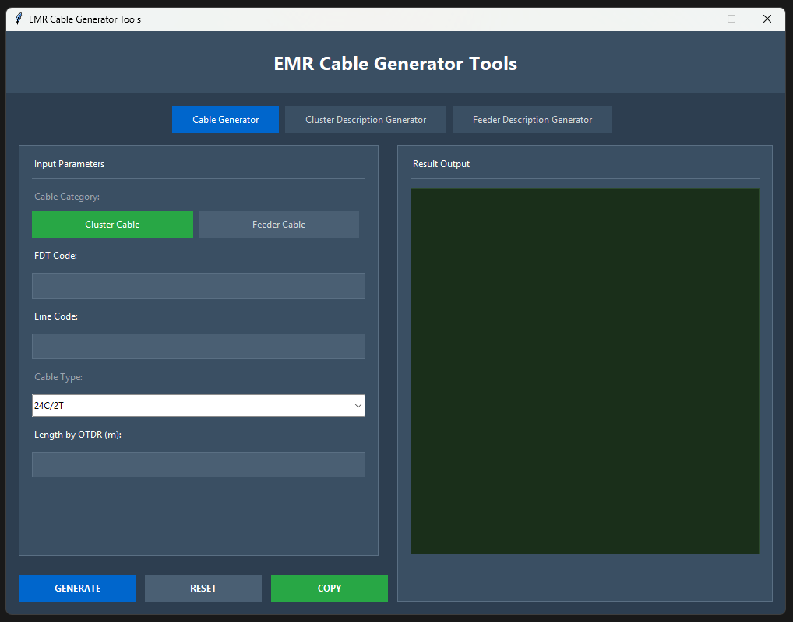
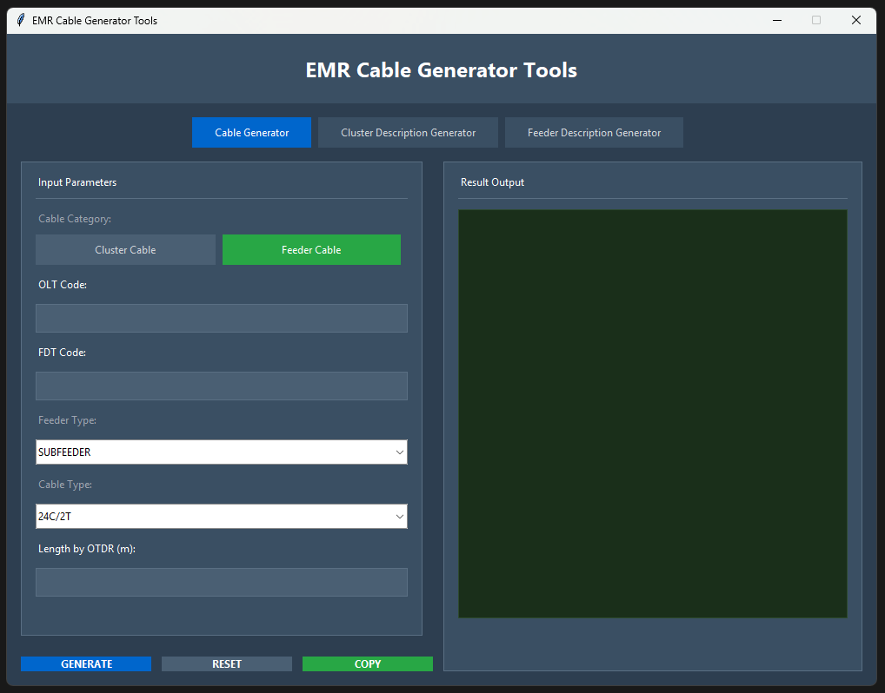
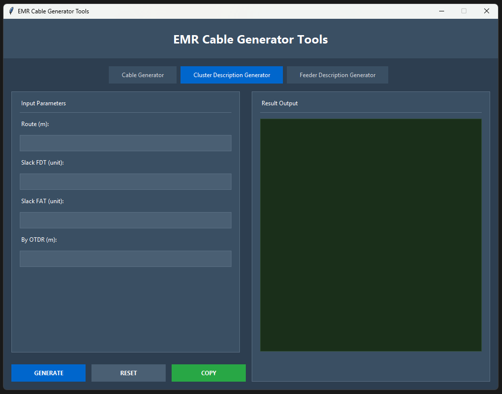
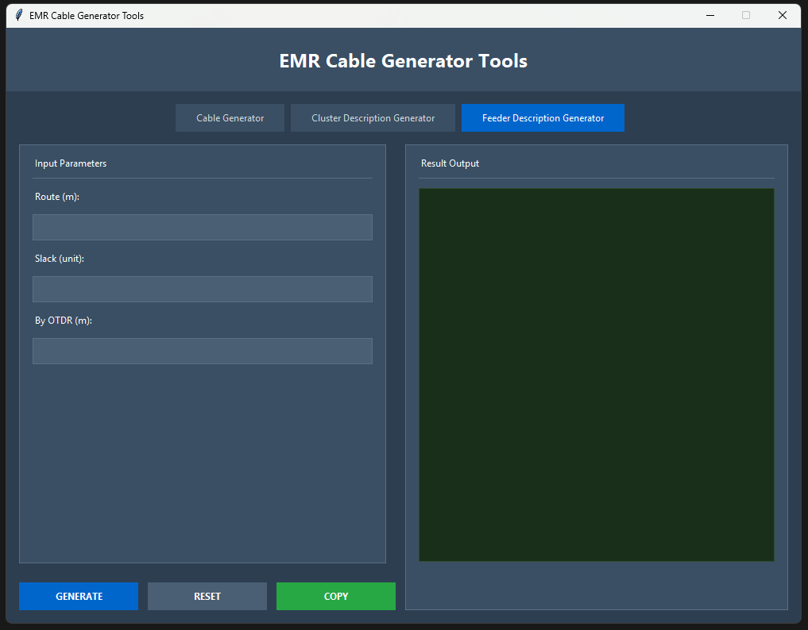

# EMR Cable Generator Tools

Modern cable generator application for EMR fiber optic projects with dark theme UI.


## 📸 Screenshots

<details open>
<summary><b>Cable Generator - Cluster</b></summary>


</details>

<details>
<summary><b>Cable Generator - Feeder</b></summary>


</details>

<details>
<summary><b>Cluster Description Calculator</b></summary>


</details>

<details>
<summary><b>Feeder Description Calculator</b></summary>


</details>

## 🎯 Features

### 1. Cable Generator
Generate cable names for two types:
- **Cluster Cable**: `FDT - CABLE LINE [code] (FO [type]) - AE - [length] M`
- **Feeder Cable**: `OLT - FDT ([FEEDER_TYPE] CABLE FO [type]) - AE - [length] M`
  - Feeder Types: SUBFEEDER, HUBFEEDER, MAINFEEDER

### 2. Cluster Description Generator
Calculate cluster cable length with:
- Route (meters)
- Slack FDT & FAT (units @ 20m each)
- 5% tolerance
- OTDR comparison

### 3. Feeder Description Generator
Calculate feeder cable length with:
- Route (meters)
- Slack (units @ 20m)
- 5% tolerance
- OTDR comparison

## 📦 Installation

### Download Pre-built Executables

Download the latest release for your platform:

| Platform | Download | Requirements |
|----------|----------|--------------|
| 🪟 **Windows** | [EMR Cable Generator.exe](https://github.com/galprim1412/ftth-cable-generator-v2/releases/latest) | Windows 10/11 |
| 🍎 **macOS** | [EMR Cable Generator.app](https://github.com/galprim1412/ftth-cable-generator-v2/releases/latest) | macOS 10.15+ |
| 🐧 **Linux** | [cable-generator](https://github.com/galprim1412/ftth-cable-generator-v2/releases/latest) | Ubuntu 20.04+, Fedora 35+ |

**Installation Steps:**

<details>
<summary><b>Windows</b></summary>

1. Download `EMR Cable Generator.exe`
2. Double-click to run (no installation needed)
3. If Windows Defender blocks it, click "More info" → "Run anyway"
</details>

<details>
<summary><b>macOS</b></summary>

1. Download `EMR Cable Generator-macOS.zip`
2. Extract and move to Applications folder
3. Right-click → Open (first time only to bypass Gatekeeper)
</details>

<details>
<summary><b>Linux</b></summary>

1. Download `cable-generator`
2. Make executable: `chmod +x cable-generator`
3. Run: `./cable-generator`
</details>

### Build from Source

**Requirements:** Python 3.11+

```bash
# Clone repository
git clone https://github.com/galprim1412/ftth-cable-generator-v2.git
cd ftth-cable-generator-v2

# Install dependencies
pip install -r requirements.txt

# Run from source
python cable_generator_figma.py

# OR build executable for your platform
python build.py
```

For detailed build instructions, see [BUILD.md](docs/BUILD.md)

## 🔨 Building Executable

### Quick Build (Any Platform)

```bash
# Install PyInstaller
pip install pyinstaller

# Build for your current platform
python build.py
```

### Platform-Specific Build Scripts

**Windows:**
```bash
build_windows.bat
```

**macOS:**
```bash
chmod +x build_macos.sh
./build_macos.sh
```

**Linux:**
```bash
chmod +x build_linux.sh
./build_linux.sh
```

**Output locations:**
- Windows: `dist/EMR Cable Generator.exe`
- macOS: `dist/EMR Cable Generator.app`
- Linux: `dist/cable-generator`

For detailed build instructions and troubleshooting, see [BUILD.md](docs/BUILD.md)

## ⚙️ Automated Builds

This repository uses GitHub Actions to automatically build for all platforms:

- **Trigger:** Push to `main` branch or create a tag
- **Platforms:** Windows, macOS, Linux
- **Download:** Go to [Actions](https://github.com/galprim1412/ftth-cable-generator-v2/actions) tab
- **Releases:** Tagged versions automatically create releases with all platform builds

## 🎨 UI Features

- ✅ Modern dark theme
- ✅ Centered window on startup
- ✅ Custom application icon
- ✅ Responsive button spacing
- ✅ Tab-based navigation
- ✅ Copy to clipboard functionality

## 📊 Comparison with C Version

| Aspect | C Version | Python Version |
|--------|-----------|----------------|
| Lines of Code | 786 | 597 |
| UI Layout | 3 separate tabs | 3 tabs in one window |
| Compilation | Required | Not required |
| Dependencies | Win32 API | Python built-in only |
| Maintenance | Difficult | Easy |
| Theme | Default Windows | Modern dark theme |

## 🚀 Usage

1. **Select Tab**: Choose Cable Generator, Cluster Description, or Feeder Description
2. **Fill Inputs**: Enter required parameters
3. **Generate**: Click GENERATE button
4. **Copy**: Use COPY button to copy result to clipboard
5. **Reset**: Click RESET to clear all inputs

## 📝 Cable Types

**Cluster Cable:**
- 24C/2T
- 36C/3T
- 48C/4T

**Feeder Cable:**
- 24C/2T
- 48C/4T
- 96C/8T
- 144C/12T
- 288C/24T

## 🛠️ Development

Project structure:
```
cable-generator-v2/
├── cable_generator_figma.py    # Main application
├── app.ico                      # Application icon
├── .gitignore                   # Git ignore rules
└── README.md                    # This file
```

## 📄 License

Internal use - EMR Project

## 👨‍💻 Author

Developed for EMR fiber optic cable management
